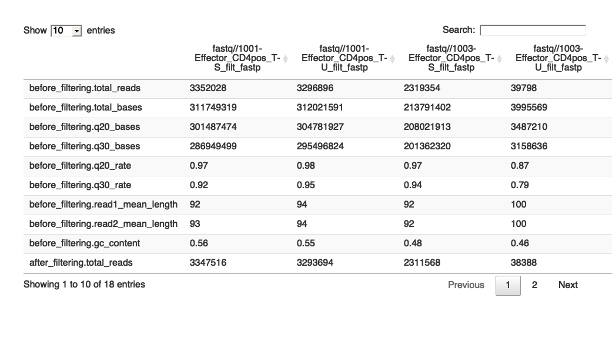
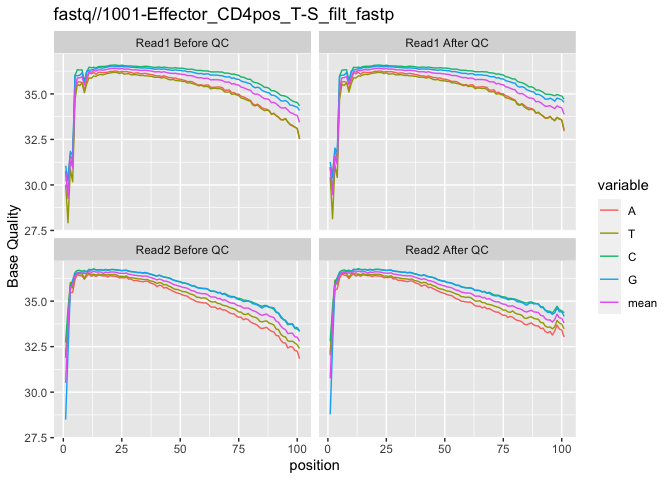
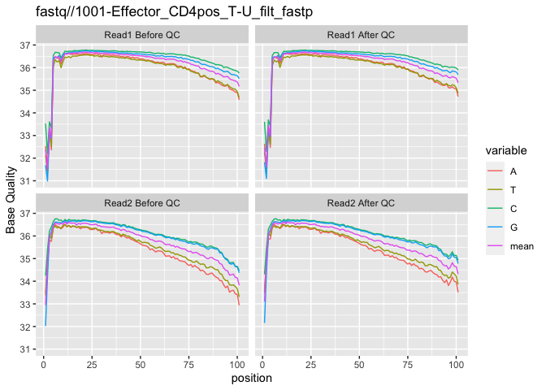
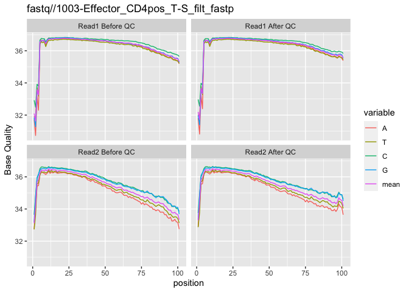
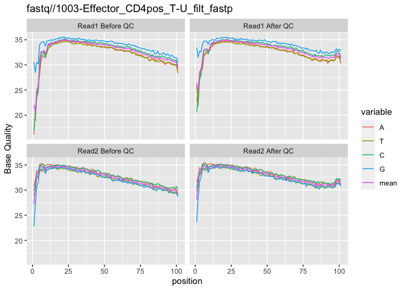

FASTQ Quality Control
================
Sam Buckberry
23/10/2021

Load R libraries

``` r
library(stringr)
library(magrittr)
library(Rfastp)
library(DT)
library(ggplot2)
library(cowplot)
```

### FASTQ quality control and filtering

The first step in analysing high-throughput short-read sequencing is to
check the quality of the reads before starting any analysis. The quality
of the data are fundamentally important for maintaining confidence in
the conclusions drawn from the experiment. Here we will perform quality
checks and pre-processing of RNA-seq data before we begin to quantify
gene expression.

Here is some example code for generating a quality control report and
trimming of sequencing adapters for one paired-end RNA-seq sample using
the `rfastp` package that is a wrapper for the
[Fastp](https://github.com/OpenGene/fastp) suite of tools. *No need to
run the below code chunk during the workshop*

``` r
read1 <- "fastq/1001-Effector_CD4pos_T-S_chr22_R1.fastq.gz"
read2 <- "fastq/1001-Effector_CD4pos_T-S_chr22_R2.fastq.gz"

out_prefix <- str_replace(string = read1,
                          pattern = "_R1.fastq.gz",
                          replacement = "_filt_fastp")

fastp_json_report <- rfastp(read1 = read1, read2 = read2, 
                            outputFastq = out_prefix,
                            adapterTrimming = TRUE,
                            cutLowQualTail = TRUE,
                            cutLowQualFront = TRUE,
                            thread = 1)
```

As we have more than one RNA-seq libray to process, we can write an R
function to process all the samples at once.

``` r
r1_list <- list.files(path = "fastq/",
                      pattern = "chr22_R1.fastq.gz",
                      full.names = TRUE)

r2_list <- list.files(path = "fastq/",
                      pattern = "chr22_R2.fastq.gz",
                      full.names = TRUE)

fq_df <- data.frame(r1 = r1_list, r2 = r2_list,
                    prefix = str_replace(r1_list,
                                        pattern = "_chr22_R1.fastq.gz",
                                        replacement = "_filt_fastp"))

# Function to run fastp for all libraries 
multi_fastp <- function(x){
    
    fastp_json_report <- rfastp(read1 = fq_df$r1[x],
                                read2 = fq_df$r2[x], 
                            outputFastq = fq_df$prefix[x],
                            adapterTrimming = TRUE,
                            cutLowQualTail = TRUE,
                            cutLowQualFront = TRUE,
                            thread = 1)
    return(fastp_json_report)
}

report_list <- lapply(1:nrow(fq_df), multi_fastp)
```

If you’ve successfully run the above code block, you will see there are
`.html` reports for each pair of fastq files in the `fastq/` folder.

Now let’s generate a table of read quality statistics generated by
fastp.

``` r
# Short function to extract summary data from fastp
get_report <- function(x){unlist(report_list[[x]]$summary)}

# Make a table of the report data.
# Some re-formatting of the numbers is required. 
report_table <- lapply(1:length(report_list), get_report) %>%
    do.call(cbind, .) %>% 
    format(scientific=FALSE,
           digits = 2,
           drop0trailing = TRUE)

report_table <- data.frame(report_table)
colnames(report_table) <- fq_df$prefix

datatable(data = report_table)
```

<!-- -->

Make some plots of the statistics.

``` r
cp_list <- lapply(X = 1:length(report_list),
                  FUN = function(x){Rfastp::curvePlot(report_list[[x]]) + ggtitle(fq_df$prefix[x])})

cp_list
```

    ## [[1]]

<!-- -->

    ## 
    ## [[2]]

<!-- -->

    ## 
    ## [[3]]

<!-- -->

    ## 
    ## [[4]]

<!-- -->

If you have [MultiQC](https://multiqc.info/) installed in your PATH, you
can generate an aggreate report using the following system call from R
and then inspect the html report titled `rna-seq-multiqc-report.html`

``` r
system("multiqc --filename rna-seq-multiqc-report.html fastq/")
```

-----

``` r
sessionInfo()
```

    ## R version 4.0.3 (2020-10-10)
    ## Platform: x86_64-apple-darwin17.0 (64-bit)
    ## Running under: macOS Big Sur 10.16
    ## 
    ## Matrix products: default
    ## BLAS:   /Library/Frameworks/R.framework/Versions/4.0/Resources/lib/libRblas.dylib
    ## LAPACK: /Library/Frameworks/R.framework/Versions/4.0/Resources/lib/libRlapack.dylib
    ## 
    ## locale:
    ## [1] en_AU.UTF-8/en_AU.UTF-8/en_AU.UTF-8/C/en_AU.UTF-8/en_AU.UTF-8
    ## 
    ## attached base packages:
    ## [1] stats     graphics  grDevices utils     datasets  methods   base     
    ## 
    ## other attached packages:
    ## [1] cowplot_1.1.1  ggplot2_3.3.5  DT_0.19        Rfastp_1.0.0   magrittr_2.0.1
    ## [6] stringr_1.4.0 
    ## 
    ## loaded via a namespace (and not attached):
    ##  [1] tidyselect_1.1.1  xfun_0.27         bslib_0.3.1       purrr_0.3.4      
    ##  [5] reshape2_1.4.4    colorspace_2.0-2  vctrs_0.3.8       generics_0.1.1   
    ##  [9] htmltools_0.5.2   yaml_2.2.1        utf8_1.2.2        rlang_0.4.12     
    ## [13] pillar_1.6.4      jquerylib_0.1.4   glue_1.4.2        withr_2.4.2      
    ## [17] DBI_1.1.1         lifecycle_1.0.1   plyr_1.8.6        munsell_0.5.0    
    ## [21] gtable_0.3.0      htmlwidgets_1.5.4 codetools_0.2-18  evaluate_0.14    
    ## [25] labeling_0.4.2    knitr_1.36        callr_3.7.0       fastmap_1.1.0    
    ## [29] ps_1.6.0          crosstalk_1.1.1   fansi_0.5.0       highr_0.9        
    ## [33] Rcpp_1.0.7        scales_1.1.1      webshot_0.5.2     jsonlite_1.7.2   
    ## [37] farver_2.1.0      rjson_0.2.20      digest_0.6.28     stringi_1.7.5    
    ## [41] processx_3.5.2    dplyr_1.0.7       grid_4.0.3        tools_4.0.3      
    ## [45] sass_0.4.0        tibble_3.1.5      crayon_1.4.2      pkgconfig_2.0.3  
    ## [49] ellipsis_0.3.2    assertthat_0.2.1  rmarkdown_2.11    R6_2.5.1         
    ## [53] compiler_4.0.3
