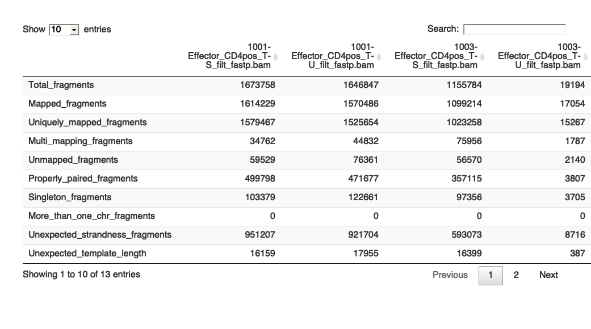
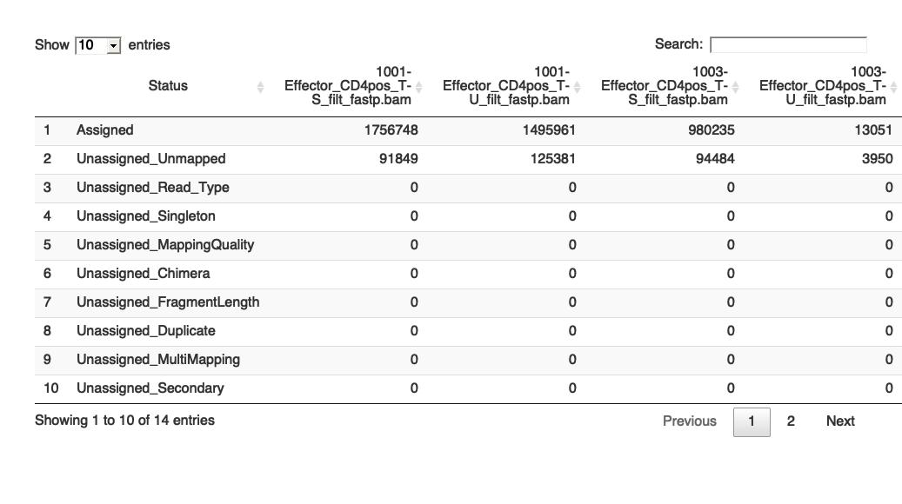
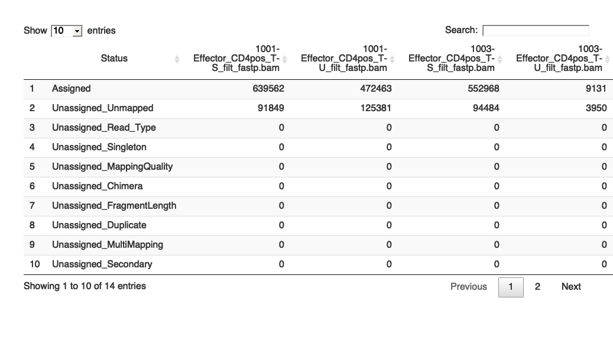

RNA-seq read alignment in R
================
Sam Buckberry
20/10/2021

Once you are confident in the quality of the RNA-seq data, you can then
move onto creating a matrix of read counts to use in differential
expression testing. To do this, we first need to map the reads to a
reference genome (or transcriptome), and then count the aligned reads
with respect to gene annotations to calculate the number of reads
mapping to each gene.

If the species under study has a well-annotated transcriptome, the reads
can be aligned to the transcript sequences instead of the reference
genome using tools such as
[Kallisto](https://pachterlab.github.io/kallisto/about) or
[Salmon](https://salmon.readthedocs.io/en/latest/salmon.html). When no
good quality reference genome or transcriptome is available for the
species being studied, you can *de novo* assemble transcripts using
tools such as
[Trinity](https://github.com/trinityrnaseq/trinityrnaseq/wiki) and then
quantify the expression levels of genes/transcripts. However, the use of
these tools is outside of the scope of this short workshop.

For RNA-seq read alignments, apart from the availability of reference
genomes and annotations, probably the most important factor to consider
when choosing an alignment tool is whether the alignment method
considers the absence of intronic regions in the sequenced reads, while
the target genome may contain introns. Therefore, it is important to
choose alignment tools that take into account alternative splicing. In
the basic setting where a read, which originates from a cDNA sequence
corresponding to an exon-exon junction, needs to be split into two parts
when aligned against the genome.

There are various tools that consider this factor such as STAR, Hisat2,
and Subread. As Subread is implimented in the `Rsubread` R package, we
will use this tool here.

Load the libraries.

``` r
library(Rsubread)
```

    ## Warning: package 'Rsubread' was built under R version 4.0.4

``` r
library(magrittr)
library(stringr)
library(DT)
```

First, we need to index the reference genome by building the Rsubread
alignment index. It is reccomended to use the option `gappedIndex =
TRUE` on a personal computer that has limited memory capacity.

``` r
buildindex(basename="reference/GRCh38_chr22", gappedIndex = TRUE,
           reference="reference/Homo_sapiens.GRCh38.dna.chromosome.22.fa.gz")
```

    ## 
    ##         ==========     _____ _    _ ____  _____  ______          _____  
    ##         =====         / ____| |  | |  _ \|  __ \|  ____|   /\   |  __ \ 
    ##           =====      | (___ | |  | | |_) | |__) | |__     /  \  | |  | |
    ##             ====      \___ \| |  | |  _ <|  _  /|  __|   / /\ \ | |  | |
    ##               ====    ____) | |__| | |_) | | \ \| |____ / ____ \| |__| |
    ##         ==========   |_____/ \____/|____/|_|  \_\______/_/    \_\_____/
    ##        Rsubread 2.4.3
    ## 
    ## //================================= setting ==================================\\
    ## ||                                                                            ||
    ## ||                Index name : GRCh38_chr22                                   ||
    ## ||               Index space : base space                                     ||
    ## ||               Index split : no-split                                       ||
    ## ||          Repeat threshold : 100 repeats                                    ||
    ## ||              Gapped index : yes                                            ||
    ## ||                                                                            ||
    ## ||       Free / total memory : 6.0GB / 16.0GB                                 ||
    ## ||                                                                            ||
    ## ||               Input files : 1 file in total                                ||
    ## ||                             o Homo_sapiens.GRCh38.dna.chromosome.22.fa.gz  ||
    ## ||                                                                            ||
    ## \\============================================================================//
    ## 
    ## //================================= Running ==================================\\
    ## ||                                                                            ||
    ## || Check the integrity of provided reference sequences ...                    ||
    ## || No format issues were found                                                ||
    ## || Scan uninformative subreads in reference sequences ...                     ||
    ## || 4076 uninformative subreads were found.                                    ||
    ## || These subreads were excluded from index building.                          ||
    ## || Estimate the index size...                                                 ||
    ## ||   41%,   0 mins elapsed, rate=272335.6k bps/s                              ||
    ## ||   49%,   0 mins elapsed, rate=80120.1k bps/s                               ||
    ## ||   58%,   0 mins elapsed, rate=54576.0k bps/s                               ||
    ## ||   66%,   0 mins elapsed, rate=39161.1k bps/s                               ||
    ## ||   74%,   0 mins elapsed, rate=30613.3k bps/s                               ||
    ## ||   83%,   0 mins elapsed, rate=25251.4k bps/s                               ||
    ## ||   91%,   0 mins elapsed, rate=21886.4k bps/s                               ||
    ## ||   99%,   0 mins elapsed, rate=19752.3k bps/s                               ||
    ## ||  108%,   0 mins elapsed, rate=18251.4k bps/s                               ||
    ## ||  116%,   0 mins elapsed, rate=17149.1k bps/s                               ||
    ## ||  124%,   0 mins elapsed, rate=16316.5k bps/s                               ||
    ## ||  133%,   0 mins elapsed, rate=15634.1k bps/s                               ||
    ## || 0.8 GB of memory is needed for index building.                             ||
    ## || Build the index...                                                         ||
    ## ||    8%,   0 mins elapsed, rate=11666.1k bps/s                               ||
    ## ||   16%,   0 mins elapsed, rate=12503.8k bps/s                               ||
    ## ||   24%,   0 mins elapsed, rate=10929.4k bps/s                               ||
    ## ||   33%,   0 mins elapsed, rate=10306.1k bps/s                               ||
    ## ||   41%,   0 mins elapsed, rate=9484.5k bps/s                                ||
    ## ||   49%,   0 mins elapsed, rate=8955.8k bps/s                                ||
    ## ||   58%,   0 mins elapsed, rate=8612.7k bps/s                                ||
    ## ||   66%,   0 mins elapsed, rate=8382.5k bps/s                                ||
    ## ||   74%,   0 mins elapsed, rate=8195.8k bps/s                                ||
    ## ||   83%,   0 mins elapsed, rate=8066.7k bps/s                                ||
    ## ||   91%,   0 mins elapsed, rate=7954.3k bps/s                                ||
    ## || Save current index block...                                                ||
    ## ||  [ 0.0% finished ]                                                         ||
    ## ||  [ 10.0% finished ]                                                        ||
    ## ||  [ 20.0% finished ]                                                        ||
    ## ||  [ 30.0% finished ]                                                        ||
    ## ||  [ 40.0% finished ]                                                        ||
    ## ||  [ 50.0% finished ]                                                        ||
    ## ||  [ 60.0% finished ]                                                        ||
    ## ||  [ 70.0% finished ]                                                        ||
    ## ||  [ 80.0% finished ]                                                        ||
    ## ||  [ 90.0% finished ]                                                        ||
    ## ||  [ 100.0% finished ]                                                       ||
    ## ||                                                                            ||
    ## ||                      Total running time: 0.3 minutes.                      ||
    ## ||            Index reference/GRCh38_chr22 was successfully built.            ||
    ## ||                                                                            ||
    ## \\============================================================================//

Now we have the reference genome built, we can align the reads to our
reference genome using the `Rsubread::align` function.

Here is an example command to align one sample to the indexed reference
genome using one thread. Here the inputs are the `.fastq.gz` files, and
the output is a `.bam` file (no need to run).

``` r
align_dat <- align(index="GRCh38",
                   readfile1 = "1001-Effector_CD4pos_T-S_filt_fastp_R1.fastq.gz",
                   readfile2 = "1001-Effector_CD4pos_T-S_filt_fastp_R2.fastq.gz",
                   output_file="1001-Effector_CD4pos_T-S.BAM",
                   nthreads = 1)
```

To process all the samples at once, we can create a table of all input
and output files and process the data by writing a function.

First, we create the table of all the input and output files:

``` r
# function to align all samples

r1_list <- list.files("fastq/", pattern = "_filt_fastp_R1.fastq.gz",
                      full.names = TRUE)

r2_list <- list.files("fastq/", pattern = "_filt_fastp_R2.fastq.gz",
                      full.names = TRUE)

bam_list <- basename(r1_list) %>%
    str_replace("_R1.fastq.gz", ".bam")

dir.create("aligned_data")
```

    ## Warning in dir.create("aligned_data"): 'aligned_data' already exists

``` r
bam_list <- str_c("aligned_data/", bam_list)

fq_df <- data.frame(r1 = r1_list, r2 = r2_list, bam = bam_list)

head(fq_df)
```

    ##                                                       r1
    ## 1 fastq//1001-Effector_CD4pos_T-S_filt_fastp_R1.fastq.gz
    ## 2 fastq//1001-Effector_CD4pos_T-U_filt_fastp_R1.fastq.gz
    ## 3 fastq//1003-Effector_CD4pos_T-S_filt_fastp_R1.fastq.gz
    ## 4 fastq//1003-Effector_CD4pos_T-U_filt_fastp_R1.fastq.gz
    ##                                                       r2
    ## 1 fastq//1001-Effector_CD4pos_T-S_filt_fastp_R2.fastq.gz
    ## 2 fastq//1001-Effector_CD4pos_T-U_filt_fastp_R2.fastq.gz
    ## 3 fastq//1003-Effector_CD4pos_T-S_filt_fastp_R2.fastq.gz
    ## 4 fastq//1003-Effector_CD4pos_T-U_filt_fastp_R2.fastq.gz
    ##                                                    bam
    ## 1 aligned_data/1001-Effector_CD4pos_T-S_filt_fastp.bam
    ## 2 aligned_data/1001-Effector_CD4pos_T-U_filt_fastp.bam
    ## 3 aligned_data/1003-Effector_CD4pos_T-S_filt_fastp.bam
    ## 4 aligned_data/1003-Effector_CD4pos_T-U_filt_fastp.bam

Double check all input files exist

``` r
all(file.exists(c(r1_list, r2_list)))
```

    ## [1] TRUE

And then write a function to align the data for each sample.

Here we are using the `align` function which is applicable to both
RNA-seq and DNA sequencing data.

``` r
# Function to align reads for each sample
align_list <- function(x){
  
  align(index="reference/GRCh38_chr22",
        type = "rna",
        sortReadsByCoordinates = TRUE,
        useAnnotation = TRUE,
        annot.ext = "reference/Homo_sapiens.GRCh38.104.chromosome.22.gtf.gz",
        isGTF = TRUE,
        readfile1= fq_df$r1[x],
        readfile2 = fq_df$r2[x],
        output_file = fq_df$bam[x],
        nthreads = 2)
}

# Apply function to list of samples
align_dat <- lapply(1:nrow(fq_df), align_list)
```

Or we could use the `subjunc` function that is designed for RNA-seq and
will also report novel exon-exon junctions, and can be tailored to
discover structural varaitions in the RNA-seq data. For more information
on this, see the `subjunc` documentation by using the `?subjunc`
command.

``` r
subjunc_list <- function(x){
  
  subjunc(index="reference/GRCh38_chr22",
        sortReadsByCoordinates = TRUE,
        useAnnotation = TRUE,
        annot.ext = "reference/Homo_sapiens.GRCh38.104.chromosome.22.gtf.gz",
        isGTF = TRUE,
        readfile1= fq_df$r1[x],
        readfile2 = fq_df$r2[x],
        output_file = fq_df$bam[x],
        nthreads = 2)
}

# Apply function to list of samples
map_dat <- lapply(1:nrow(fq_df), subjunc_list)
```

    ## 
    ##         ==========     _____ _    _ ____  _____  ______          _____  
    ##         =====         / ____| |  | |  _ \|  __ \|  ____|   /\   |  __ \ 
    ##           =====      | (___ | |  | | |_) | |__) | |__     /  \  | |  | |
    ##             ====      \___ \| |  | |  _ <|  _  /|  __|   / /\ \ | |  | |
    ##               ====    ____) | |__| | |_) | | \ \| |____ / ____ \| |__| |
    ##         ==========   |_____/ \____/|____/|_|  \_\______/_/    \_\_____/
    ##        Rsubread 2.4.3
    ## 
    ## //================================= setting ==================================\\
    ## ||                                                                            ||
    ## || Function      : Read alignment + Junction detection (RNA-Seq)              ||
    ## || Input file 1  : 1001-Effector_CD4pos_T-S_filt_fastp_R1.fastq.gz            ||
    ## || Input file 2  : 1001-Effector_CD4pos_T-S_filt_fastp_R2.fastq.gz            ||
    ## || Output file   : 1001-Effector_CD4pos_T-S_filt_fastp.bam (BAM), Sorted      ||
    ## || Index name    : GRCh38_chr22                                               ||
    ## ||                                                                            ||
    ## ||                    ------------------------------------                    ||
    ## ||                                                                            ||
    ## ||                               Threads : 2                                  ||
    ## ||                          Phred offset : 33                                 ||
    ## ||               # of extracted subreads : 14                                 ||
    ## ||                        Min read1 vote : 1                                  ||
    ## ||                        Min read2 vote : 1                                  ||
    ## ||                     Max fragment size : 600                                ||
    ## ||                     Min fragment size : 50                                 ||
    ## ||                        Max mismatches : 3                                  ||
    ## ||                      Max indel length : 5                                  ||
    ## ||            Report multi-mapping reads : yes                                ||
    ## || Max alignments per multi-mapping read : 1                                  ||
    ## ||                           Annotations : Homo_sapiens.GRCh38.104.chromo ... ||
    ## ||                                                                            ||
    ## \\============================================================================//
    ## 
    ## //================ Running (08-Nov-2021 15:18:41, pid=65864) =================\\
    ## ||                                                                            ||
    ## || Check the input reads.                                                     ||
    ## || The input file contains base space reads.                                  ||
    ## || Initialise the memory objects.                                             ||
    ## || Estimate the mean read length.                                             ||
    ## || The range of Phred scores observed in the data is [2,37]                   ||
    ## || Create the output BAM file.                                                ||
    ## || Check the index.                                                           ||
    ## || Init the voting space.                                                     ||
    ## || Load the annotation file.                                                  ||
    ## || 31502 annotation records were loaded.                                      ||
    ## || Global environment is initialised.                                         ||
    ## || Load the 1-th index block...                                               ||
    ## || The index block has been loaded.                                           ||
    ## || Start read mapping in chunk.                                               ||
    ## ||    0% completed, 0.2 mins elapsed, rate=33.1k fragments per second         ||
    ## ||    7% completed, 0.3 mins elapsed, rate=24.0k fragments per second         ||
    ## ||   14% completed, 0.4 mins elapsed, rate=19.5k fragments per second         ||
    ## ||   20% completed, 0.4 mins elapsed, rate=21.7k fragments per second         ||
    ## ||   27% completed, 0.5 mins elapsed, rate=21.7k fragments per second         ||
    ## ||   35% completed, 0.7 mins elapsed, rate=19.7k fragments per second         ||
    ## ||   41% completed, 0.8 mins elapsed, rate=18.8k fragments per second         ||
    ## ||   48% completed, 0.8 mins elapsed, rate=20.3k fragments per second         ||
    ## ||   54% completed, 0.9 mins elapsed, rate=20.6k fragments per second         ||
    ## ||   61% completed, 1.0 mins elapsed, rate=20.9k fragments per second         ||
    ## ||   Estimated fragment length : 97 bp                                        ||
    ## ||   69% completed, 1.2 mins elapsed, rate=16.9k fragments per second         ||
    ## ||   73% completed, 1.2 mins elapsed, rate=17.5k fragments per second         ||
    ## ||   76% completed, 1.2 mins elapsed, rate=17.7k fragments per second         ||
    ## ||   79% completed, 1.2 mins elapsed, rate=18.2k fragments per second         ||
    ## ||   83% completed, 1.3 mins elapsed, rate=18.7k fragments per second         ||
    ## ||   86% completed, 1.3 mins elapsed, rate=19.2k fragments per second         ||
    ## ||   89% completed, 1.3 mins elapsed, rate=19.4k fragments per second         ||
    ## ||   93% completed, 1.3 mins elapsed, rate=19.9k fragments per second         ||
    ## ||   96% completed, 1.3 mins elapsed, rate=20.3k fragments per second         ||
    ## ||  100% completed, 1.4 mins elapsed, rate=20.8k fragments per second         ||
    ## ||                                                                            ||
    ## ||                           Completed successfully.                          ||
    ## ||                                                                            ||
    ## \\====================================    ====================================//
    ## 
    ## //================================   Summary =================================\\
    ## ||                                                                            ||
    ## ||             Total fragments : 1,673,758                                    ||
    ## ||                      Mapped : 1,614,229 (96.4%)                            ||
    ## ||             Uniquely mapped : 1,579,467                                    ||
    ## ||               Multi-mapping : 34,762                                       ||
    ## ||                                                                            ||
    ## ||                    Unmapped : 59,529                                       ||
    ## ||                                                                            ||
    ## ||             Properly paired : 499,798                                      ||
    ## ||         Not properly paired : 1,114,431                                    ||
    ## ||                   Singleton : 103,379                                      ||
    ## ||                    Chimeric : 0                                            ||
    ## ||       Unexpected strandness : 951,207                                      ||
    ## ||  Unexpected fragment length : 16,159                                       ||
    ## ||       Unexpected read order : 43,686                                       ||
    ## ||                                                                            ||
    ## ||                   Junctions : 5,082                                        ||
    ## ||                      Indels : 9,070                                        ||
    ## ||                                                                            ||
    ## ||                Running time : 1.6 minutes                                  ||
    ## ||                                                                            ||
    ## \\============================================================================//
    ## 
    ## 
    ##         ==========     _____ _    _ ____  _____  ______          _____  
    ##         =====         / ____| |  | |  _ \|  __ \|  ____|   /\   |  __ \ 
    ##           =====      | (___ | |  | | |_) | |__) | |__     /  \  | |  | |
    ##             ====      \___ \| |  | |  _ <|  _  /|  __|   / /\ \ | |  | |
    ##               ====    ____) | |__| | |_) | | \ \| |____ / ____ \| |__| |
    ##         ==========   |_____/ \____/|____/|_|  \_\______/_/    \_\_____/
    ##        Rsubread 2.4.3
    ## 
    ## //================================= setting ==================================\\
    ## ||                                                                            ||
    ## || Function      : Read alignment + Junction detection (RNA-Seq)              ||
    ## || Input file 1  : 1001-Effector_CD4pos_T-U_filt_fastp_R1.fastq.gz            ||
    ## || Input file 2  : 1001-Effector_CD4pos_T-U_filt_fastp_R2.fastq.gz            ||
    ## || Output file   : 1001-Effector_CD4pos_T-U_filt_fastp.bam (BAM), Sorted      ||
    ## || Index name    : GRCh38_chr22                                               ||
    ## ||                                                                            ||
    ## ||                    ------------------------------------                    ||
    ## ||                                                                            ||
    ## ||                               Threads : 2                                  ||
    ## ||                          Phred offset : 33                                 ||
    ## ||               # of extracted subreads : 14                                 ||
    ## ||                        Min read1 vote : 1                                  ||
    ## ||                        Min read2 vote : 1                                  ||
    ## ||                     Max fragment size : 600                                ||
    ## ||                     Min fragment size : 50                                 ||
    ## ||                        Max mismatches : 3                                  ||
    ## ||                      Max indel length : 5                                  ||
    ## ||            Report multi-mapping reads : yes                                ||
    ## || Max alignments per multi-mapping read : 1                                  ||
    ## ||                           Annotations : Homo_sapiens.GRCh38.104.chromo ... ||
    ## ||                                                                            ||
    ## \\============================================================================//
    ## 
    ## //================ Running (08-Nov-2021 15:20:19, pid=65864) =================\\
    ## ||                                                                            ||
    ## || Check the input reads.                                                     ||
    ## || The input file contains base space reads.                                  ||
    ## || Initialise the memory objects.                                             ||
    ## || Estimate the mean read length.                                             ||
    ## || The range of Phred scores observed in the data is [2,37]                   ||
    ## || Create the output BAM file.                                                ||
    ## || Check the index.                                                           ||
    ## || Init the voting space.                                                     ||
    ## || Load the annotation file.                                                  ||
    ## || 31502 annotation records were loaded.                                      ||
    ## || Global environment is initialised.                                         ||
    ## || Load the 1-th index block...                                               ||
    ## || The index block has been loaded.                                           ||
    ## || Start read mapping in chunk.                                               ||
    ## ||    0% completed, 0.2 mins elapsed, rate=30.5k fragments per second         ||
    ## ||    6% completed, 0.2 mins elapsed, rate=69.6k fragments per second         ||
    ## ||   14% completed, 0.3 mins elapsed, rate=24.1k fragments per second         ||
    ## ||   21% completed, 0.5 mins elapsed, rate=20.2k fragments per second         ||
    ## ||   28% completed, 0.6 mins elapsed, rate=19.2k fragments per second         ||
    ## ||   35% completed, 0.7 mins elapsed, rate=18.5k fragments per second         ||
    ## ||   42% completed, 0.8 mins elapsed, rate=19.1k fragments per second         ||
    ## ||   48% completed, 0.8 mins elapsed, rate=20.1k fragments per second         ||
    ## ||   54% completed, 0.9 mins elapsed, rate=20.7k fragments per second         ||
    ## ||   61% completed, 1.0 mins elapsed, rate=20.3k fragments per second         ||
    ## ||   Estimated fragment length : 102 bp                                       ||
    ## ||   69% completed, 1.2 mins elapsed, rate=16.0k fragments per second         ||
    ## ||   73% completed, 1.2 mins elapsed, rate=16.5k fragments per second         ||
    ## ||   76% completed, 1.2 mins elapsed, rate=17.0k fragments per second         ||
    ## ||   79% completed, 1.3 mins elapsed, rate=17.5k fragments per second         ||
    ## ||   83% completed, 1.3 mins elapsed, rate=18.1k fragments per second         ||
    ## ||   86% completed, 1.3 mins elapsed, rate=18.5k fragments per second         ||
    ## ||   89% completed, 1.3 mins elapsed, rate=18.9k fragments per second         ||
    ## ||   92% completed, 1.3 mins elapsed, rate=19.3k fragments per second         ||
    ## ||   96% completed, 1.4 mins elapsed, rate=19.8k fragments per second         ||
    ## ||                                                                            ||
    ## ||                           Completed successfully.                          ||
    ## ||                                                                            ||
    ## \\====================================    ====================================//
    ## 
    ## //================================   Summary =================================\\
    ## ||                                                                            ||
    ## ||             Total fragments : 1,646,847                                    ||
    ## ||                      Mapped : 1,570,486 (95.4%)                            ||
    ## ||             Uniquely mapped : 1,525,654                                    ||
    ## ||               Multi-mapping : 44,832                                       ||
    ## ||                                                                            ||
    ## ||                    Unmapped : 76,361                                       ||
    ## ||                                                                            ||
    ## ||             Properly paired : 471,677                                      ||
    ## ||         Not properly paired : 1,098,809                                    ||
    ## ||                   Singleton : 122,661                                      ||
    ## ||                    Chimeric : 0                                            ||
    ## ||       Unexpected strandness : 921,704                                      ||
    ## ||  Unexpected fragment length : 17,955                                       ||
    ## ||       Unexpected read order : 36,489                                       ||
    ## ||                                                                            ||
    ## ||                   Junctions : 3,947                                        ||
    ## ||                      Indels : 7,965                                        ||
    ## ||                                                                            ||
    ## ||                Running time : 1.6 minutes                                  ||
    ## ||                                                                            ||
    ## \\============================================================================//
    ## 
    ## 
    ##         ==========     _____ _    _ ____  _____  ______          _____  
    ##         =====         / ____| |  | |  _ \|  __ \|  ____|   /\   |  __ \ 
    ##           =====      | (___ | |  | | |_) | |__) | |__     /  \  | |  | |
    ##             ====      \___ \| |  | |  _ <|  _  /|  __|   / /\ \ | |  | |
    ##               ====    ____) | |__| | |_) | | \ \| |____ / ____ \| |__| |
    ##         ==========   |_____/ \____/|____/|_|  \_\______/_/    \_\_____/
    ##        Rsubread 2.4.3
    ## 
    ## //================================= setting ==================================\\
    ## ||                                                                            ||
    ## || Function      : Read alignment + Junction detection (RNA-Seq)              ||
    ## || Input file 1  : 1003-Effector_CD4pos_T-S_filt_fastp_R1.fastq.gz            ||
    ## || Input file 2  : 1003-Effector_CD4pos_T-S_filt_fastp_R2.fastq.gz            ||
    ## || Output file   : 1003-Effector_CD4pos_T-S_filt_fastp.bam (BAM), Sorted      ||
    ## || Index name    : GRCh38_chr22                                               ||
    ## ||                                                                            ||
    ## ||                    ------------------------------------                    ||
    ## ||                                                                            ||
    ## ||                               Threads : 2                                  ||
    ## ||                          Phred offset : 33                                 ||
    ## ||               # of extracted subreads : 14                                 ||
    ## ||                        Min read1 vote : 1                                  ||
    ## ||                        Min read2 vote : 1                                  ||
    ## ||                     Max fragment size : 600                                ||
    ## ||                     Min fragment size : 50                                 ||
    ## ||                        Max mismatches : 3                                  ||
    ## ||                      Max indel length : 5                                  ||
    ## ||            Report multi-mapping reads : yes                                ||
    ## || Max alignments per multi-mapping read : 1                                  ||
    ## ||                           Annotations : Homo_sapiens.GRCh38.104.chromo ... ||
    ## ||                                                                            ||
    ## \\============================================================================//
    ## 
    ## //================ Running (08-Nov-2021 15:21:57, pid=65864) =================\\
    ## ||                                                                            ||
    ## || Check the input reads.                                                     ||
    ## || The input file contains base space reads.                                  ||
    ## || Initialise the memory objects.                                             ||
    ## || Estimate the mean read length.                                             ||
    ## || The range of Phred scores observed in the data is [2,37]                   ||
    ## || Create the output BAM file.                                                ||
    ## || Check the index.                                                           ||
    ## || Init the voting space.                                                     ||
    ## || Load the annotation file.                                                  ||
    ## || 31502 annotation records were loaded.                                      ||
    ## || Global environment is initialised.                                         ||
    ## || Load the 1-th index block...                                               ||
    ## || The index block has been loaded.                                           ||
    ## || Start read mapping in chunk.                                               ||
    ## ||    1% completed, 0.2 mins elapsed, rate=22.8k fragments per second         ||
    ## ||    8% completed, 0.3 mins elapsed, rate=18.4k fragments per second         ||
    ## ||   14% completed, 0.3 mins elapsed, rate=17.7k fragments per second         ||
    ## ||   21% completed, 0.4 mins elapsed, rate=18.0k fragments per second         ||
    ## ||   27% completed, 0.4 mins elapsed, rate=18.4k fragments per second         ||
    ## ||   34% completed, 0.5 mins elapsed, rate=18.2k fragments per second         ||
    ## ||   40% completed, 0.6 mins elapsed, rate=18.6k fragments per second         ||
    ## ||   46% completed, 0.6 mins elapsed, rate=19.1k fragments per second         ||
    ## ||   52% completed, 0.7 mins elapsed, rate=20.1k fragments per second         ||
    ## ||   58% completed, 0.7 mins elapsed, rate=21.0k fragments per second         ||
    ## ||   65% completed, 0.8 mins elapsed, rate=20.9k fragments per second         ||
    ## ||   Estimated fragment length : 100 bp                                       ||
    ## ||   70% completed, 0.8 mins elapsed, rate=15.9k fragments per second         ||
    ## ||   73% completed, 0.9 mins elapsed, rate=16.2k fragments per second         ||
    ## ||   77% completed, 0.9 mins elapsed, rate=16.6k fragments per second         ||
    ## ||   80% completed, 0.9 mins elapsed, rate=16.8k fragments per second         ||
    ## ||   84% completed, 1.0 mins elapsed, rate=17.0k fragments per second         ||
    ## ||   87% completed, 1.0 mins elapsed, rate=17.0k fragments per second         ||
    ## ||   90% completed, 1.0 mins elapsed, rate=17.3k fragments per second         ||
    ## ||   93% completed, 1.0 mins elapsed, rate=17.6k fragments per second         ||
    ## ||   96% completed, 1.0 mins elapsed, rate=17.9k fragments per second         ||
    ## ||  100% completed, 1.1 mins elapsed, rate=18.2k fragments per second         ||
    ## ||                                                                            ||
    ## ||                           Completed successfully.                          ||
    ## ||                                                                            ||
    ## \\====================================    ====================================//
    ## 
    ## //================================   Summary =================================\\
    ## ||                                                                            ||
    ## ||             Total fragments : 1,155,784                                    ||
    ## ||                      Mapped : 1,099,214 (95.1%)                            ||
    ## ||             Uniquely mapped : 1,023,258                                    ||
    ## ||               Multi-mapping : 75,956                                       ||
    ## ||                                                                            ||
    ## ||                    Unmapped : 56,570                                       ||
    ## ||                                                                            ||
    ## ||             Properly paired : 357,115                                      ||
    ## ||         Not properly paired : 742,099                                      ||
    ## ||                   Singleton : 97,356                                       ||
    ## ||                    Chimeric : 0                                            ||
    ## ||       Unexpected strandness : 593,073                                      ||
    ## ||  Unexpected fragment length : 16,399                                       ||
    ## ||       Unexpected read order : 35,271                                       ||
    ## ||                                                                            ||
    ## ||                   Junctions : 1,442                                        ||
    ## ||                      Indels : 11,309                                       ||
    ## ||                                                                            ||
    ## ||                Running time : 1.2 minutes                                  ||
    ## ||                                                                            ||
    ## \\============================================================================//
    ## 
    ## 
    ##         ==========     _____ _    _ ____  _____  ______          _____  
    ##         =====         / ____| |  | |  _ \|  __ \|  ____|   /\   |  __ \ 
    ##           =====      | (___ | |  | | |_) | |__) | |__     /  \  | |  | |
    ##             ====      \___ \| |  | |  _ <|  _  /|  __|   / /\ \ | |  | |
    ##               ====    ____) | |__| | |_) | | \ \| |____ / ____ \| |__| |
    ##         ==========   |_____/ \____/|____/|_|  \_\______/_/    \_\_____/
    ##        Rsubread 2.4.3
    ## 
    ## //================================= setting ==================================\\
    ## ||                                                                            ||
    ## || Function      : Read alignment + Junction detection (RNA-Seq)              ||
    ## || Input file 1  : 1003-Effector_CD4pos_T-U_filt_fastp_R1.fastq.gz            ||
    ## || Input file 2  : 1003-Effector_CD4pos_T-U_filt_fastp_R2.fastq.gz            ||
    ## || Output file   : 1003-Effector_CD4pos_T-U_filt_fastp.bam (BAM), Sorted      ||
    ## || Index name    : GRCh38_chr22                                               ||
    ## ||                                                                            ||
    ## ||                    ------------------------------------                    ||
    ## ||                                                                            ||
    ## ||                               Threads : 2                                  ||
    ## ||                          Phred offset : 33                                 ||
    ## ||               # of extracted subreads : 14                                 ||
    ## ||                        Min read1 vote : 1                                  ||
    ## ||                        Min read2 vote : 1                                  ||
    ## ||                     Max fragment size : 600                                ||
    ## ||                     Min fragment size : 50                                 ||
    ## ||                        Max mismatches : 3                                  ||
    ## ||                      Max indel length : 5                                  ||
    ## ||            Report multi-mapping reads : yes                                ||
    ## || Max alignments per multi-mapping read : 1                                  ||
    ## ||                           Annotations : Homo_sapiens.GRCh38.104.chromo ... ||
    ## ||                                                                            ||
    ## \\============================================================================//
    ## 
    ## //================ Running (08-Nov-2021 15:23:11, pid=65864) =================\\
    ## ||                                                                            ||
    ## || Check the input reads.                                                     ||
    ## || The input file contains base space reads.                                  ||
    ## || Initialise the memory objects.                                             ||
    ## || Estimate the mean read length.                                             ||
    ## || The range of Phred scores observed in the data is [2,37]                   ||
    ## || Create the output BAM file.                                                ||
    ## || Check the index.                                                           ||
    ## || Init the voting space.                                                     ||
    ## || Load the annotation file.                                                  ||
    ## || 31502 annotation records were loaded.                                      ||
    ## || Global environment is initialised.                                         ||
    ## || Load the 1-th index block...                                               ||
    ## || The index block has been loaded.                                           ||
    ## || Start read mapping in chunk.                                               ||
    ## ||   Estimated fragment length : 146 bp                                       ||
    ## ||   84% completed, 0.2 mins elapsed, rate=1.1k fragments per second          ||
    ## ||                                                                            ||
    ## ||                           Completed successfully.                          ||
    ## ||                                                                            ||
    ## \\====================================    ====================================//
    ## 
    ## //================================   Summary =================================\\
    ## ||                                                                            ||
    ## ||             Total fragments : 19,194                                       ||
    ## ||                      Mapped : 17,054 (88.9%)                               ||
    ## ||             Uniquely mapped : 15,267                                       ||
    ## ||               Multi-mapping : 1,787                                        ||
    ## ||                                                                            ||
    ## ||                    Unmapped : 2,140                                        ||
    ## ||                                                                            ||
    ## ||             Properly paired : 3,807                                        ||
    ## ||         Not properly paired : 13,247                                       ||
    ## ||                   Singleton : 3,705                                        ||
    ## ||                    Chimeric : 0                                            ||
    ## ||       Unexpected strandness : 8,716                                        ||
    ## ||  Unexpected fragment length : 387                                          ||
    ## ||       Unexpected read order : 439                                          ||
    ## ||                                                                            ||
    ## ||                   Junctions : 106                                          ||
    ## ||                      Indels : 448                                          ||
    ## ||                                                                            ||
    ## ||                Running time : 0.2 minutes                                  ||
    ## ||                                                                            ||
    ## \\============================================================================//

> ***Challenge:*** Try to align the reads by allowing multi-mappers (set
> unique = FALSE), and allow for up to 6 “best” locations to be reported
> (nBestLocations = 6). Specify the output file names in the `fq_df`
> object by substituting the `df_fq$bam` data with `df_fq$bam <-
> str_replace_all(string = df_fq$bam, pattern = ".bam", replacement =
> "_multi.bam")` so not to overwrite the unique alignment bam files.
> Then look at the proportion of reads mapped and see if we get any more
> reads mapping by specifying a less stringent criteria.

Convert alignment data into matrix and view as table.

``` r
map_dat <- do.call(cbind, map_dat)
datatable(data = map_dat)
```

<!-- -->

Or use the `propmapped` function to check the proportion of aligned
reads for all libraries.

``` r
props <- propmapped(files = fq_df$bam)
props
```

    ##                                         NumTotal NumMapped PropMapped
    ## 1001-Effector_CD4pos_T-S_filt_fastp.bam  1675845   1648527   0.983699
    ## 1001-Effector_CD4pos_T-U_filt_fastp.bam  1648361   1620936   0.983362
    ## 1003-Effector_CD4pos_T-S_filt_fastp.bam  1159542   1140728   0.983775
    ## 1003-Effector_CD4pos_T-U_filt_fastp.bam    19828     19451   0.980986

Now lets create the table of counts for genes and transcripts using the
`featureCounts` function from Subread.

``` r
# Check BAM files exist
stopifnot(file.exists(fq_df$bam))

# Specify GTF file used for counts
gtf_path <- "reference/Homo_sapiens.GRCh38.104.chromosome.22.gtf.gz"

### Calculate gene counts
gene_counts <- featureCounts(files = fq_df$bam,
                             GTF.attrType = "gene_id",
                             annot.ext = gtf_path,
                             isGTFAnnotationFile = TRUE,
                             isPairedEnd = TRUE,
                             nthreads=1)
```

    ## 
    ##         ==========     _____ _    _ ____  _____  ______          _____  
    ##         =====         / ____| |  | |  _ \|  __ \|  ____|   /\   |  __ \ 
    ##           =====      | (___ | |  | | |_) | |__) | |__     /  \  | |  | |
    ##             ====      \___ \| |  | |  _ <|  _  /|  __|   / /\ \ | |  | |
    ##               ====    ____) | |__| | |_) | | \ \| |____ / ____ \| |__| |
    ##         ==========   |_____/ \____/|____/|_|  \_\______/_/    \_\_____/
    ##        Rsubread 2.4.3
    ## 
    ## //========================== featureCounts setting ===========================\\
    ## ||                                                                            ||
    ## ||             Input files : 4 BAM files                                      ||
    ## ||                                                                            ||
    ## ||                           1001-Effector_CD4pos_T-S_filt_fastp.bam          ||
    ## ||                           1001-Effector_CD4pos_T-U_filt_fastp.bam          ||
    ## ||                           1003-Effector_CD4pos_T-S_filt_fastp.bam          ||
    ## ||                           1003-Effector_CD4pos_T-U_filt_fastp.bam          ||
    ## ||                                                                            ||
    ## ||              Paired-end : yes                                              ||
    ## ||        Count read pairs : yes                                              ||
    ## ||              Annotation : Homo_sapiens.GRCh38.104.chromosome.22.gtf.gz ... ||
    ## ||      Dir for temp files : .                                                ||
    ## ||                 Threads : 1                                                ||
    ## ||                   Level : meta-feature level                               ||
    ## ||      Multimapping reads : counted                                          ||
    ## || Multi-overlapping reads : not counted                                      ||
    ## ||   Min overlapping bases : 1                                                ||
    ## ||                                                                            ||
    ## \\============================================================================//
    ## 
    ## //================================= Running ==================================\\
    ## ||                                                                            ||
    ## || Load annotation file Homo_sapiens.GRCh38.104.chromosome.22.gtf.gz ...      ||
    ## ||    Features : 31502                                                        ||
    ## ||    Meta-features : 1388                                                    ||
    ## ||    Chromosomes/contigs : 1                                                 ||
    ## ||                                                                            ||
    ## || Process BAM file 1001-Effector_CD4pos_T-S_filt_fastp.bam...                ||
    ## ||    Paired-end reads are included.                                          ||
    ## ||    Total alignments : 2984691                                              ||
    ## ||    Successfully assigned alignments : 1756748 (58.9%)                      ||
    ## ||    Running time : 0.47 minutes                                             ||
    ## ||                                                                            ||
    ## || Process BAM file 1001-Effector_CD4pos_T-U_filt_fastp.bam...                ||
    ## ||    Paired-end reads are included.                                          ||
    ## ||    Total alignments : 3003153                                              ||
    ## ||    Successfully assigned alignments : 1495961 (49.8%)                      ||
    ## ||    Running time : 0.45 minutes                                             ||
    ## ||                                                                            ||
    ## || Process BAM file 1003-Effector_CD4pos_T-S_filt_fastp.bam...                ||
    ## ||    Paired-end reads are included.                                          ||
    ## ||    Total alignments : 2111024                                              ||
    ## ||    Successfully assigned alignments : 980235 (46.4%)                       ||
    ## ||    Running time : 0.31 minutes                                             ||
    ## ||                                                                            ||
    ## || Process BAM file 1003-Effector_CD4pos_T-U_filt_fastp.bam...                ||
    ## ||    Paired-end reads are included.                                          ||
    ## ||    Total alignments : 37015                                                ||
    ## ||    Successfully assigned alignments : 13051 (35.3%)                        ||
    ## ||    Running time : 0.01 minutes                                             ||
    ## ||                                                                            ||
    ## || Write the final count table.                                               ||
    ## || Write the read assignment summary.                                         ||
    ## ||                                                                            ||
    ## \\============================================================================//

``` r
### Calculate transcript counts
tx_counts <- featureCounts(files = fq_df$bam,
                         GTF.attrType = "transcript_id",
                         annot.ext = gtf_path,
                         isGTFAnnotationFile = TRUE,
                         isPairedEnd = TRUE,
                         nthreads=1)
```

    ## 
    ##         ==========     _____ _    _ ____  _____  ______          _____  
    ##         =====         / ____| |  | |  _ \|  __ \|  ____|   /\   |  __ \ 
    ##           =====      | (___ | |  | | |_) | |__) | |__     /  \  | |  | |
    ##             ====      \___ \| |  | |  _ <|  _  /|  __|   / /\ \ | |  | |
    ##               ====    ____) | |__| | |_) | | \ \| |____ / ____ \| |__| |
    ##         ==========   |_____/ \____/|____/|_|  \_\______/_/    \_\_____/
    ##        Rsubread 2.4.3
    ## 
    ## //========================== featureCounts setting ===========================\\
    ## ||                                                                            ||
    ## ||             Input files : 4 BAM files                                      ||
    ## ||                                                                            ||
    ## ||                           1001-Effector_CD4pos_T-S_filt_fastp.bam          ||
    ## ||                           1001-Effector_CD4pos_T-U_filt_fastp.bam          ||
    ## ||                           1003-Effector_CD4pos_T-S_filt_fastp.bam          ||
    ## ||                           1003-Effector_CD4pos_T-U_filt_fastp.bam          ||
    ## ||                                                                            ||
    ## ||              Paired-end : yes                                              ||
    ## ||        Count read pairs : yes                                              ||
    ## ||              Annotation : Homo_sapiens.GRCh38.104.chromosome.22.gtf.gz ... ||
    ## ||      Dir for temp files : .                                                ||
    ## ||                 Threads : 1                                                ||
    ## ||                   Level : meta-feature level                               ||
    ## ||      Multimapping reads : counted                                          ||
    ## || Multi-overlapping reads : not counted                                      ||
    ## ||   Min overlapping bases : 1                                                ||
    ## ||                                                                            ||
    ## \\============================================================================//
    ## 
    ## //================================= Running ==================================\\
    ## ||                                                                            ||
    ## || Load annotation file Homo_sapiens.GRCh38.104.chromosome.22.gtf.gz ...      ||
    ## ||    Features : 31502                                                        ||
    ## ||    Meta-features : 5051                                                    ||
    ## ||    Chromosomes/contigs : 1                                                 ||
    ## ||                                                                            ||
    ## || Process BAM file 1001-Effector_CD4pos_T-S_filt_fastp.bam...                ||
    ## ||    Paired-end reads are included.                                          ||
    ## ||    Total alignments : 2984691                                              ||
    ## ||    Successfully assigned alignments : 639562 (21.4%)                       ||
    ## ||    Running time : 0.46 minutes                                             ||
    ## ||                                                                            ||
    ## || Process BAM file 1001-Effector_CD4pos_T-U_filt_fastp.bam...                ||
    ## ||    Paired-end reads are included.                                          ||
    ## ||    Total alignments : 3003153                                              ||
    ## ||    Successfully assigned alignments : 472463 (15.7%)                       ||
    ## ||    Running time : 0.52 minutes                                             ||
    ## ||                                                                            ||
    ## || Process BAM file 1003-Effector_CD4pos_T-S_filt_fastp.bam...                ||
    ## ||    Paired-end reads are included.                                          ||
    ## ||    Total alignments : 2111024                                              ||
    ## ||    Successfully assigned alignments : 552968 (26.2%)                       ||
    ## ||    Running time : 0.36 minutes                                             ||
    ## ||                                                                            ||
    ## || Process BAM file 1003-Effector_CD4pos_T-U_filt_fastp.bam...                ||
    ## ||    Paired-end reads are included.                                          ||
    ## ||    Total alignments : 37015                                                ||
    ## ||    Successfully assigned alignments : 9131 (24.7%)                         ||
    ## ||    Running time : 0.01 minutes                                             ||
    ## ||                                                                            ||
    ## || Write the final count table.                                               ||
    ## || Write the read assignment summary.                                         ||
    ## ||                                                                            ||
    ## \\============================================================================//

Inspect gene count statistics

``` r
datatable(gene_counts$stat)
```

<!-- -->

Inspect transcript count statistics

``` r
datatable(tx_counts$stat)
```

<!-- -->

Inspect the counts table

``` r
head(gene_counts$counts)
```

    ##                 1001-Effector_CD4pos_T-S_filt_fastp.bam
    ## ENSG00000286406                                      27
    ## ENSG00000231565                                      14
    ## ENSG00000215270                                    6439
    ## ENSG00000198445                                       0
    ## ENSG00000279442                                     158
    ## ENSG00000273442                                       0
    ##                 1001-Effector_CD4pos_T-U_filt_fastp.bam
    ## ENSG00000286406                                      67
    ## ENSG00000231565                                       0
    ## ENSG00000215270                                    1272
    ## ENSG00000198445                                       0
    ## ENSG00000279442                                     165
    ## ENSG00000273442                                       0
    ##                 1003-Effector_CD4pos_T-S_filt_fastp.bam
    ## ENSG00000286406                                     323
    ## ENSG00000231565                                       0
    ## ENSG00000215270                                      42
    ## ENSG00000198445                                       0
    ## ENSG00000279442                                     839
    ## ENSG00000273442                                       1
    ##                 1003-Effector_CD4pos_T-U_filt_fastp.bam
    ## ENSG00000286406                                       1
    ## ENSG00000231565                                       0
    ## ENSG00000215270                                       0
    ## ENSG00000198445                                       0
    ## ENSG00000279442                                      61
    ## ENSG00000273442                                       0

Save the counts objects to use in downstream analyses.

``` r
saveRDS(object = gene_counts, file = "Effector_CD4pos_gene_counts_chr22.Rds")
saveRDS(object = tx_counts, file = "Effector_CD4pos_transcript_counts_chr22.Rds")
```

\===

``` r
sessionInfo()
```

    ## R version 4.0.3 (2020-10-10)
    ## Platform: x86_64-apple-darwin17.0 (64-bit)
    ## Running under: macOS Big Sur 10.16
    ## 
    ## Matrix products: default
    ## BLAS:   /Library/Frameworks/R.framework/Versions/4.0/Resources/lib/libRblas.dylib
    ## LAPACK: /Library/Frameworks/R.framework/Versions/4.0/Resources/lib/libRlapack.dylib
    ## 
    ## locale:
    ## [1] en_AU.UTF-8
    ## 
    ## attached base packages:
    ## [1] stats     graphics  grDevices utils     datasets  methods   base     
    ## 
    ## other attached packages:
    ## [1] DT_0.19        stringr_1.4.0  magrittr_2.0.1 Rsubread_2.4.3
    ## 
    ## loaded via a namespace (and not attached):
    ##  [1] knitr_1.36        lattice_0.20-45   R6_2.5.1          rlang_0.4.12     
    ##  [5] fastmap_1.1.0     highr_0.9         tools_4.0.3       webshot_0.5.2    
    ##  [9] grid_4.0.3        xfun_0.27         jquerylib_0.1.4   htmltools_0.5.2  
    ## [13] crosstalk_1.1.1   yaml_2.2.1        digest_0.6.28     processx_3.5.2   
    ## [17] Matrix_1.3-4      callr_3.7.0       ps_1.6.0          sass_0.4.0       
    ## [21] htmlwidgets_1.5.4 codetools_0.2-18  evaluate_0.14     rmarkdown_2.11   
    ## [25] stringi_1.7.5     compiler_4.0.3    bslib_0.3.1       jsonlite_1.7.2
