RNA-seq differential expression testing
================

So far in this workshop, we have been working with a subset of RNA-seq
data that originates from chromosome 22 genes in order for the data
processing to be efficient. However, for this section, we can analyse
the data for all genes that has been pre-processed and saved in this
GitHub repository.

``` r
library(magrittr)
library(stringr)
library(edgeR)
library(ggplot2)
library(pheatmap)
library(gprofiler2)
library(wiggleplotr)
library(GenomicFeatures)
```

    ## Warning: package 'GenomicFeatures' was built under R version 4.0.4

    ## Warning: package 'BiocGenerics' was built under R version 4.0.5

    ## Warning: package 'GenomeInfoDb' was built under R version 4.0.5

``` r
library(ensembldb)
```

    ## Warning: package 'ensembldb' was built under R version 4.0.5

``` r
library(EnsDb.Hsapiens.v86)
library(biomaRt)
```

To get started, load the sample data which has sample IDs and the BAM
file identifiers in our counts matrix

``` r
mdat <- read.csv("metadata/sample_data.csv")
mdat
```

    ##          Sample Donor    Treatment                          Bam
    ## 1 1001_CD4pos_S  1001   Stimulated 1001-Effector_CD4pos_T-S.bam
    ## 2 1001_CD4pos_U  1001 Unstimulated 1001-Effector_CD4pos_T-U.bam
    ## 3 1002_CD4pos_S  1002   Stimulated 1002-Effector_CD4pos_T-S.bam
    ## 4 1003_CD4pos_S  1003   Stimulated 1003-Effector_CD4pos_T-S.bam
    ## 5 1003_CD4pos_U  1003 Unstimulated 1003-Effector_CD4pos_T-U.bam
    ## 6 1004_CD4pos_S  1004   Stimulated 1004-Effector_CD4pos_T-S.bam
    ## 7 1004_CD4pos_U  1004 Unstimulated 1004-Effector_CD4pos_T-U.bam

And then load the gene and transcript counts data

``` r
gene_counts <- readRDS("processed_data/Effector_CD4pos_ALL_gene_counts.Rds") 
tx_counts <- readRDS("processed_data/Effector_CD4pos_ALL_transcript_counts.Rds")
```

Next, let’s ensure metadata and data labels are in the same order

``` r
if (all(mdat$Bam != gene_counts$targets)){
    ind <- match(gene_counts$targets, mdat$Bam)
    mdat <- mdat[ind, ]
}

stopifnot(all(mdat$Bam == gene_counts$targets))
```

Create the DGElist object for using edgeR.

``` r
y <- DGEList(counts = gene_counts$counts,
             samples = mdat$Sample,
             group = mdat$Treatment)
```

### Design matrix for differential testing

``` r
design <- model.matrix(~ 0 + y$samples$group)

# Clean up the column names (will make things easier later)
colnames(design) <- c("Stimulated", "Unstimulated")
design
```

    ##   Stimulated Unstimulated
    ## 1          1            0
    ## 2          0            1
    ## 3          1            0
    ## 4          1            0
    ## 5          0            1
    ## 6          1            0
    ## 7          0            1
    ## attr(,"assign")
    ## [1] 1 1
    ## attr(,"contrasts")
    ## attr(,"contrasts")$`y$samples$group`
    ## [1] "contr.treatment"

Boxplot of counts-per-million (CPM) normalised expression for each
sample. This allows us to inspect the distribution of library size
normalised gene expression values.

``` r
boxplot(cpm(y, log=TRUE), names=y$samples$samples)
```

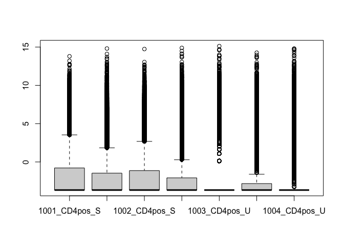<!-- -->

Next we filter genes/transcripts to remove features with low counts that
would not be useful in statistical testing. edgeR has a handy function
for this called `filterByExpr` that filters features that do not have
sufficient counts for differential expression testing.

``` r
keep <- filterByExpr(y)
table(keep)
```

    ## keep
    ## FALSE  TRUE 
    ## 46063 14601

``` r
y <- y[keep, , keep.lib.sizes=FALSE]
```

Boxplots of log2 counts for each sample now the data have been filtered

``` r
boxplot(cpm(y, log=TRUE), names=y$samples$samples)
```

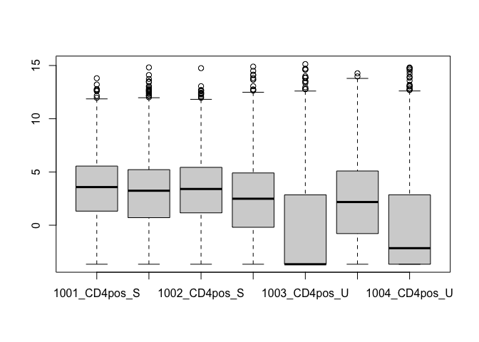<!-- -->

Calculate normalisation factors and dispersions used in differential
expression testing

``` r
y <- calcNormFactors(y)
y$samples
```

    ##                                     group lib.size norm.factors       samples
    ## 1001-Effector_CD4pos_T-S.bam   Stimulated 31823308    1.3371366 1001_CD4pos_S
    ## 1001-Effector_CD4pos_T-U.bam Unstimulated 31528015    1.0724007 1001_CD4pos_U
    ## 1002-Effector_CD4pos_T-S.bam   Stimulated 31564932    1.3792698 1002_CD4pos_S
    ## 1003-Effector_CD4pos_T-S.bam   Stimulated 31492798    0.9608878 1003_CD4pos_S
    ## 1003-Effector_CD4pos_T-U.bam Unstimulated   981781    1.2773281 1003_CD4pos_U
    ## 1004-Effector_CD4pos_T-S.bam   Stimulated 15995261    0.9754972 1004_CD4pos_S
    ## 1004-Effector_CD4pos_T-U.bam Unstimulated 34398120    0.4222958 1004_CD4pos_U

``` r
y <- estimateDisp(y, robust = TRUE)
```

    ## Using classic mode.

**Plot samples using multi-dimensional scaling** How do the samples
group based on the genes with the largest differences? Do they group by
sample donor or by treatment group? In this type of plot, you want to
look for outliers.

``` r
plotMDS(y, labels = y$samples$samples)
```

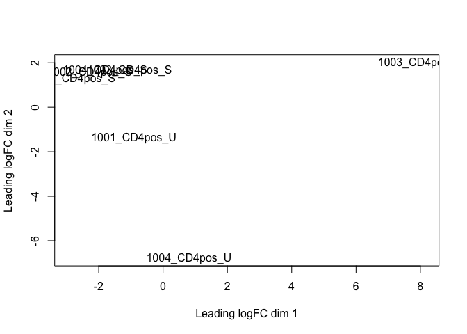<!-- -->

``` r
plotMDS(y, labels = y$samples$group)
```

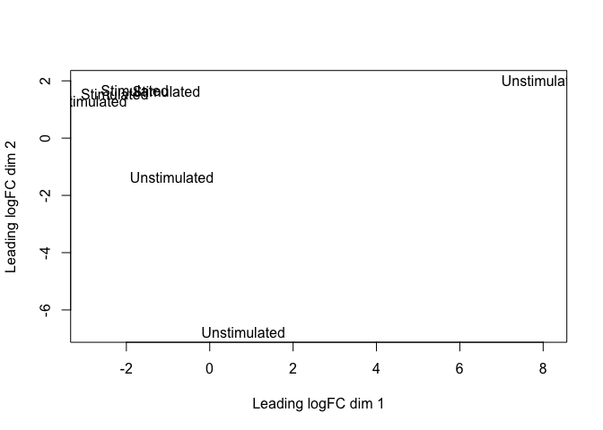<!-- -->

Differential testing using the exact test in edgeR

``` r
et <- exactTest(y)
tt <- topTags(et, n = nrow(y))
```

How many DE genes are there with FDR \< 0.05 and logFC \> 1?

``` r
sum((tt$table$FDR < 0.05) & (abs(tt$table$logFC) > 1))
```

    ## [1] 217

### Differential testing using Limma-Voom

``` r
v <- voom(counts = y, design = design, plot = TRUE)
```

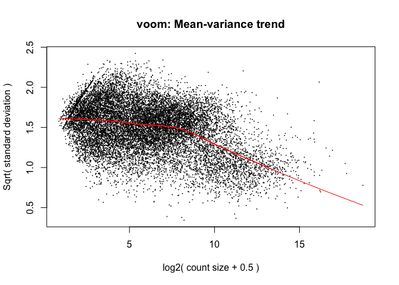<!-- -->

``` r
boxplot(v$E, names=v$targets$samples)
```

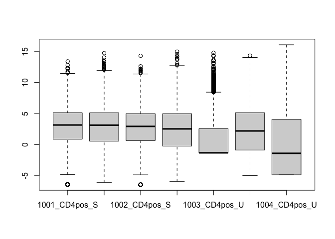<!-- -->

If you want to normalise further using quantile normalisation

``` r
vq <- voom(counts = y, design = design, plot = TRUE,
           normalize.method = "quantile")
```

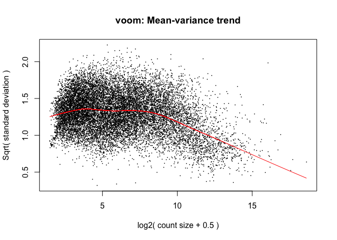<!-- -->

``` r
boxplot(vq$E)
```

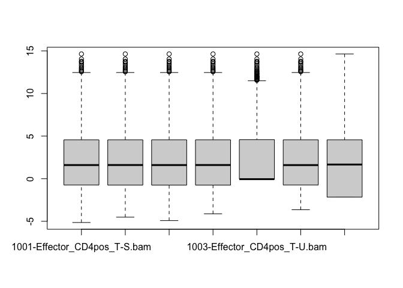<!-- -->
Notice how the quantile normalisation made the distribtions of
expression extimates for each library look more similar?

> ***Challenge:*** From here, try to compare the results of using Limma
> Voom with and without quantile normalisation and see how this impacts
> your downstream results.

### Differential expression testing

Fitting linear models in Limma

``` r
fit <- lmFit(object = v, design = design)
```

Make the contrasts matrix

``` r
contr <- makeContrasts(Stimulated - Unstimulated, levels = colnames(coef(fit)))
contr
```

    ##               Contrasts
    ## Levels         Stimulated - Unstimulated
    ##   Stimulated                           1
    ##   Unstimulated                        -1

Estimate contrasts for each gene

``` r
fit2 <- contrasts.fit(fit, contr)
```

Empirical Bayes smoothing of standard errors (shrinks standard errors
that are much larger or smaller than those from other genes towards the
average standard error) (see
<https://www.degruyter.com/doi/10.2202/1544-6115.1027>)

``` r
eb <- eBayes(fit2)
```

Check out the top differential expressed genes

``` r
topTable(eb)
```

    ##                      logFC    AveExpr         t      P.Value   adj.P.Val
    ## ENSG00000205542  -2.903518 12.0897038 -7.717038 1.131592e-07 0.001652237
    ## ENSG00000157514  -8.694894  5.6780167 -7.020050 5.050777e-07 0.001843660
    ## ENSG00000170345  -7.902632  5.6248957 -6.914266 6.373893e-07 0.001861304
    ## ENSG00000164400  10.124208  4.4009088  7.023800 5.009420e-07 0.001843660
    ## ENSG00000138442  10.804281  2.8861370  7.062787 4.599551e-07 0.001843660
    ## ENSG00000111348  -3.112227 10.4640783 -6.185181 3.293878e-06 0.003276944
    ## ENSG00000034510  -2.929228 11.1324408 -6.121318 3.815358e-06 0.003276944
    ## ENSG00000102471   9.817206  4.4450715  6.700215 1.025186e-06 0.002138391
    ## ENSG00000244734 -11.279000 -0.8845334 -6.770613 8.762708e-07 0.002132405
    ## ENSG00000198727  -2.322594 12.0565324 -6.023293 4.785254e-06 0.003587011
    ##                        B
    ## ENSG00000205542 7.793746
    ## ENSG00000157514 5.436410
    ## ENSG00000170345 5.247579
    ## ENSG00000164400 4.703210
    ## ENSG00000138442 4.618178
    ## ENSG00000111348 4.602966
    ## ENSG00000034510 4.406678
    ## ENSG00000102471 4.226422
    ## ENSG00000244734 4.081884
    ## ENSG00000198727 4.063234

Put all DE testing results into an object for plotting and saving

``` r
tt2 <- topTable(eb, number = nrow(v))
tt2$Significant <- ((abs(tt2$logFC) > 1) & (tt2$adj.P.Val < 0.05))
```

How many DE genes are there?

``` r
table(tt2$Significant)
```

    ## 
    ## FALSE  TRUE 
    ## 13906   695

### Differential expression summary plots

Volcano plot

``` r
gg_volcano <- ggplot(tt2, aes(x = logFC, y = -log10(P.Value),
                             fill=Significant, colour=Significant)) +
    geom_point(alpha=0.5) +
    geom_vline(xintercept = c(-1, 1), linetype="dashed")
gg_volcano
```

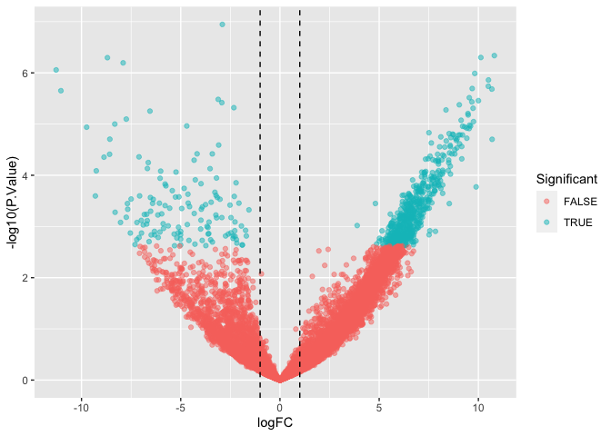<!-- -->

MA plot

``` r
gg_ma <- ggplot(tt2, aes(x = AveExpr, y = logFC, colour=Significant)) +
    geom_point(alpha=0.5) +
    geom_vline(xintercept = c(1), linetype="dashed") +
    geom_hline(yintercept = c(-1, 1), linetype="dashed")
gg_ma
```

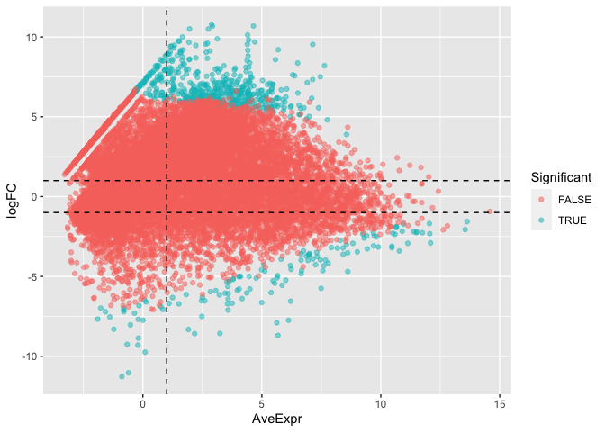<!-- -->

### Significant gene plots

DE gene heatmap of DE genes

``` r
top_de_cpm <- v$E[rownames(v$E) %in% rownames(tt2)[tt2$Significant == TRUE], ]
colnames(top_de_cpm) <- v$targets$samples

pheatmap(top_de_cpm, scale = "row", show_rownames = FALSE)
```

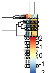<!-- -->

Plot normalised gene expression for top genes

``` r
plot_gene <- function(gene_ids){
    
    # Get the normalised expression data for the selected genes
    dat <- v$E[rownames(v$E) %in% gene_ids, ] %>% 
        data.frame()
    colnames(dat) <- v$targets$samples
    
    # Re-shape the data into the ggplot preffered long format
    dat <- tibble::rownames_to_column(dat, var = "gene_id") %>%
        tidyr::gather(sample, value, -gene_id)
    
    # Add the group data
    dat$group <- v$targets$group[match(dat$sample, v$targets$samples)]
    
    # plot the gene expression vaues
    ggplot(data = dat, aes(x = group, y = value)) + 
        geom_point(size=3, alpha=0.5) +
        facet_wrap(~gene_id, scales = "free_y") +
        ylab("Normalised gene expression") +
        theme_bw()
        
}

my_top_genes <- rownames(tt2)[tt2$Significant == TRUE][1:6]

plot_gene(gene_ids = my_top_genes)
```

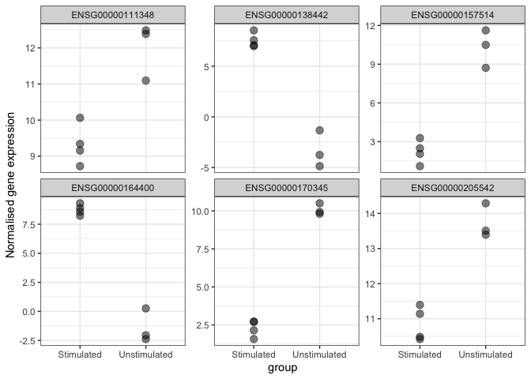<!-- -->

### Genome browser track plots

First, we download annotation data for our genes/transcripts from
Ensembl

``` r
ensembl_mart <- useMart("ENSEMBL_MART_ENSEMBL",
                        host = "jan2020.archive.ensembl.org")

ensembl_dataset <- useDataset("hsapiens_gene_ensembl", mart=ensembl_mart)
ensembl_dataset
```

    ## Object of class 'Mart':
    ##   Using the ENSEMBL_MART_ENSEMBL BioMart database
    ##   Using the hsapiens_gene_ensembl dataset

``` r
attributes <- listAttributes(ensembl_dataset)
head(attributes)
```

    ##                            name                  description         page
    ## 1               ensembl_gene_id               Gene stable ID feature_page
    ## 2       ensembl_gene_id_version       Gene stable ID version feature_page
    ## 3         ensembl_transcript_id         Transcript stable ID feature_page
    ## 4 ensembl_transcript_id_version Transcript stable ID version feature_page
    ## 5            ensembl_peptide_id            Protein stable ID feature_page
    ## 6    ensembl_peptide_id_version    Protein stable ID version feature_page

``` r
selected_attributes <- c("ensembl_transcript_id", "ensembl_gene_id", 
                        "external_gene_name", "strand", 
                        "gene_biotype", "transcript_biotype",
                        "chromosome_name", "start_position",
                        "end_position")

bm_data <- getBM(attributes = selected_attributes,
                 mart = ensembl_dataset)
head(bm_data)
```

    ##   ensembl_transcript_id ensembl_gene_id external_gene_name strand
    ## 1       ENST00000387314 ENSG00000210049              MT-TF      1
    ## 2       ENST00000389680 ENSG00000211459            MT-RNR1      1
    ## 3       ENST00000387342 ENSG00000210077              MT-TV      1
    ## 4       ENST00000387347 ENSG00000210082            MT-RNR2      1
    ## 5       ENST00000386347 ENSG00000209082             MT-TL1      1
    ## 6       ENST00000361390 ENSG00000198888             MT-ND1      1
    ##     gene_biotype transcript_biotype chromosome_name start_position end_position
    ## 1        Mt_tRNA            Mt_tRNA              MT            577          647
    ## 2        Mt_rRNA            Mt_rRNA              MT            648         1601
    ## 3        Mt_tRNA            Mt_tRNA              MT           1602         1670
    ## 4        Mt_rRNA            Mt_rRNA              MT           1671         3229
    ## 5        Mt_tRNA            Mt_tRNA              MT           3230         3304
    ## 6 protein_coding     protein_coding              MT           3307         4262

``` r
# rename the columns to suit the plotting functions
bm_data <- dplyr::rename(bm_data, 
                     transcript_id = ensembl_transcript_id, 
                     gene_id = ensembl_gene_id, 
                     gene_name = external_gene_name)
head(bm_data)
```

    ##     transcript_id         gene_id gene_name strand   gene_biotype
    ## 1 ENST00000387314 ENSG00000210049     MT-TF      1        Mt_tRNA
    ## 2 ENST00000389680 ENSG00000211459   MT-RNR1      1        Mt_rRNA
    ## 3 ENST00000387342 ENSG00000210077     MT-TV      1        Mt_tRNA
    ## 4 ENST00000387347 ENSG00000210082   MT-RNR2      1        Mt_rRNA
    ## 5 ENST00000386347 ENSG00000209082    MT-TL1      1        Mt_tRNA
    ## 6 ENST00000361390 ENSG00000198888    MT-ND1      1 protein_coding
    ##   transcript_biotype chromosome_name start_position end_position
    ## 1            Mt_tRNA              MT            577          647
    ## 2            Mt_rRNA              MT            648         1601
    ## 3            Mt_tRNA              MT           1602         1670
    ## 4            Mt_rRNA              MT           1671         3229
    ## 5            Mt_tRNA              MT           3230         3304
    ## 6     protein_coding              MT           3307         4262

And annotate the DE gene table

``` r
ind <- match(rownames(tt2), bm_data$gene_id)
tt_annotated <- cbind(tt2, bm_data[ind, ])
```

And get the postions of exons for plotting

``` r
exons <- exonsBy(EnsDb.Hsapiens.v86, by = "gene")
```

Then create a table of our bigwig files that we will use for plotting.
Remember, our bigwig files we created earlier were only for chromosome
22 mapped reads, so we will have to limit our plotting to chromosome 22
differential genes here.

``` r
bw_files <- list.files(path = "aligned_data/",
                       pattern = "bigwig$",
                       full.names = TRUE)

ids <- basename(bw_files) %>%
    str_remove("_filt_fastp_sorted.bigwig") %>%
    str_remove("Effector_CD4pos_")

condition <- ifelse(test = grepl(pattern = "_T-S_", x = bw_files),
                    yes = "Stimulated", "Unstimulated")

bw_df <- data.frame(sample_id=ids, track_id=ids,
                    scaling_factor=1, bigWig=bw_files, colour_group=condition)
bw_df
```

    ##   sample_id track_id scaling_factor
    ## 1  1001-T-S 1001-T-S              1
    ## 2  1001-T-U 1001-T-U              1
    ## 3  1003-T-S 1003-T-S              1
    ## 4  1003-T-U 1003-T-U              1
    ##                                                            bigWig colour_group
    ## 1 aligned_data//1001-Effector_CD4pos_T-S_filt_fastp_sorted.bigwig   Stimulated
    ## 2 aligned_data//1001-Effector_CD4pos_T-U_filt_fastp_sorted.bigwig Unstimulated
    ## 3 aligned_data//1003-Effector_CD4pos_T-S_filt_fastp_sorted.bigwig   Stimulated
    ## 4 aligned_data//1003-Effector_CD4pos_T-U_filt_fastp_sorted.bigwig Unstimulated

Get the top DE genes from chromosome 22

``` r
chr22_de_genes <- tt_annotated$gene_id[tt_annotated$Significant == TRUE & tt_annotated$chromosome_name == "22"]
```

And then use this information to plot the coverage of differential
expressed genes for each sample

``` r
plotCoverage(exons = exons[chr22_de_genes[1]], track_data = bw_df,
             transcript_annotations = bm_data, 
             rescale_introns = TRUE)
```

    ## Warning: `select_()` was deprecated in dplyr 0.7.0.
    ## Please use `select()` instead.
    ## This warning is displayed once every 8 hours.
    ## Call `lifecycle::last_lifecycle_warnings()` to see where this warning was generated.

    ## Warning: `mutate_()` was deprecated in dplyr 0.7.0.
    ## Please use `mutate()` instead.
    ## See vignette('programming') for more help
    ## This warning is displayed once every 8 hours.
    ## Call `lifecycle::last_lifecycle_warnings()` to see where this warning was generated.

    ## Warning: `summarise_()` was deprecated in dplyr 0.7.0.
    ## Please use `summarise()` instead.
    ## This warning is displayed once every 8 hours.
    ## Call `lifecycle::last_lifecycle_warnings()` to see where this warning was generated.

    ## Warning: `group_by_()` was deprecated in dplyr 0.7.0.
    ## Please use `group_by()` instead.
    ## See vignette('programming') for more help
    ## This warning is displayed once every 8 hours.
    ## Call `lifecycle::last_lifecycle_warnings()` to see where this warning was generated.

    ## Warning: `arrange_()` was deprecated in dplyr 0.7.0.
    ## Please use `arrange()` instead.
    ## See vignette('programming') for more help
    ## This warning is displayed once every 8 hours.
    ## Call `lifecycle::last_lifecycle_warnings()` to see where this warning was generated.

    ## Warning: `filter_()` was deprecated in dplyr 0.7.0.
    ## Please use `filter()` instead.
    ## See vignette('programming') for more help
    ## This warning is displayed once every 8 hours.
    ## Call `lifecycle::last_lifecycle_warnings()` to see where this warning was generated.

    ## Warning: Removed 1 rows containing missing values (geom_text).

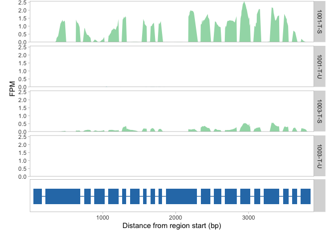<!-- -->

``` r
plotCoverage(exons = exons[chr22_de_genes[3]], track_data = bw_df,
             transcript_annotations = bm_data,
             rescale_introns = FALSE)
```

    ## Warning: `data_frame()` was deprecated in tibble 1.1.0.
    ## Please use `tibble()` instead.
    ## This warning is displayed once every 8 hours.
    ## Call `lifecycle::last_lifecycle_warnings()` to see where this warning was generated.

    ## Warning: Removed 1 rows containing missing values (geom_text).

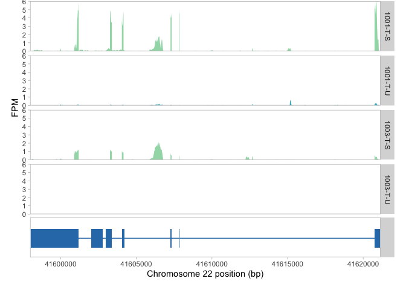<!-- -->

### Ontology testing

Finally, we can use the `gprofiler` package to test for enrichment of
gene ontology terms (among other things) in our differential expressed
gene list as follows

``` r
ontology_result <- gprofiler2::gost(query = rownames(tt2)[tt2$Significant])
head(ontology_result$result)
```

    ##     query significant      p_value term_size query_size intersection_size
    ## 1 query_1        TRUE 0.0001715163         5        216                 5
    ## 2 query_1        TRUE 0.0009791390         6        216                 5
    ## 3 query_1        TRUE 0.0029311480         4        216                 4
    ## 4 query_1        TRUE 0.0032608239         7        216                 5
    ## 5 query_1        TRUE 0.0082744377         8        216                 5
    ## 6 query_1        TRUE 0.0139696751         5        216                 4
    ##    precision    recall    term_id source                       term_name
    ## 1 0.02314815 1.0000000 CORUM:2201  CORUM             PCNA-RFC2-5 complex
    ## 2 0.02314815 0.8333333 CORUM:2797  CORUM       PCNA-CHL12-RFC2-5 complex
    ## 3 0.01851852 1.0000000 CORUM:2200  CORUM               RFC2-5 subcomplex
    ## 4 0.02314815 0.7142857 CORUM:2804  CORUM      CTF18-cohesion-RFC complex
    ## 5 0.02314815 0.6250000 CORUM:3070  CORUM CTF18-cohesion-RFC-POLH complex
    ## 6 0.01851852 0.8000000 CORUM:2810  CORUM               RAD17-RFC complex
    ##   effective_domain_size source_order       parents
    ## 1                  3627          938 CORUM:0000000
    ## 2                  3627         1201 CORUM:0000000
    ## 3                  3627          937 CORUM:0000000
    ## 4                  3627         1207 CORUM:0000000
    ## 5                  3627         1375 CORUM:0000000
    ## 6                  3627         1212 CORUM:0000000

Plot ontology result

``` r
gprofiler2::gostplot(ontology_result)
```

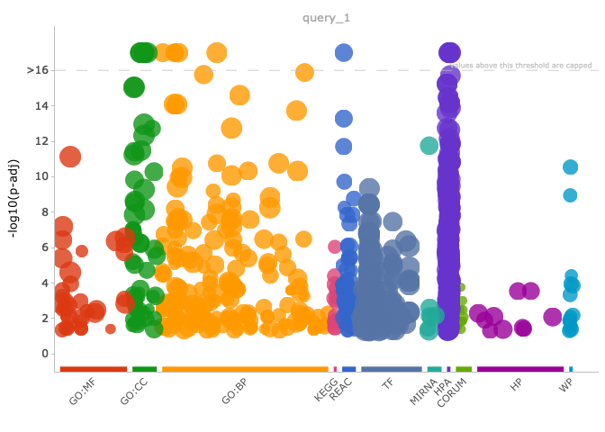<!-- -->

\===

``` r
sessionInfo()
```

    ## R version 4.0.3 (2020-10-10)
    ## Platform: x86_64-apple-darwin17.0 (64-bit)
    ## Running under: macOS Big Sur 10.16
    ## 
    ## Matrix products: default
    ## BLAS:   /Library/Frameworks/R.framework/Versions/4.0/Resources/lib/libRblas.dylib
    ## LAPACK: /Library/Frameworks/R.framework/Versions/4.0/Resources/lib/libRlapack.dylib
    ## 
    ## locale:
    ## [1] en_AU.UTF-8/en_AU.UTF-8/en_AU.UTF-8/C/en_AU.UTF-8/en_AU.UTF-8
    ## 
    ## attached base packages:
    ## [1] stats4    parallel  stats     graphics  grDevices utils     datasets 
    ## [8] methods   base     
    ## 
    ## other attached packages:
    ##  [1] biomaRt_2.46.3            EnsDb.Hsapiens.v86_2.99.0
    ##  [3] ensembldb_2.14.1          AnnotationFilter_1.14.0  
    ##  [5] GenomicFeatures_1.42.3    AnnotationDbi_1.52.0     
    ##  [7] Biobase_2.50.0            GenomicRanges_1.42.0     
    ##  [9] GenomeInfoDb_1.26.7       IRanges_2.24.1           
    ## [11] S4Vectors_0.28.1          BiocGenerics_0.36.1      
    ## [13] wiggleplotr_1.14.0        gprofiler2_0.2.1         
    ## [15] pheatmap_1.0.12           ggplot2_3.3.5            
    ## [17] edgeR_3.32.1              limma_3.46.0             
    ## [19] stringr_1.4.0             magrittr_2.0.1           
    ## 
    ## loaded via a namespace (and not attached):
    ##  [1] ProtGenerics_1.22.0         bitops_1.0-7               
    ##  [3] matrixStats_0.61.0          bit64_4.0.5                
    ##  [5] RColorBrewer_1.1-2          progress_1.2.2             
    ##  [7] httr_1.4.2                  tools_4.0.3                
    ##  [9] utf8_1.2.2                  R6_2.5.1                   
    ## [11] DBI_1.1.1                   lazyeval_0.2.2             
    ## [13] colorspace_2.0-2            withr_2.4.2                
    ## [15] tidyselect_1.1.1            prettyunits_1.1.1          
    ## [17] bit_4.0.4                   curl_4.3.2                 
    ## [19] compiler_4.0.3              xml2_1.3.2                 
    ## [21] DelayedArray_0.16.3         plotly_4.10.0              
    ## [23] rtracklayer_1.50.0          scales_1.1.1               
    ## [25] askpass_1.1                 rappdirs_0.3.3             
    ## [27] digest_0.6.28               Rsamtools_2.6.0            
    ## [29] rmarkdown_2.11              XVector_0.30.0             
    ## [31] pkgconfig_2.0.3             htmltools_0.5.2            
    ## [33] MatrixGenerics_1.2.1        dbplyr_2.1.1               
    ## [35] fastmap_1.1.0               htmlwidgets_1.5.4          
    ## [37] rlang_0.4.12                RSQLite_2.2.8              
    ## [39] generics_0.1.1              jsonlite_1.7.2             
    ## [41] BiocParallel_1.24.1         dplyr_1.0.7                
    ## [43] RCurl_1.98-1.5              GenomeInfoDbData_1.2.4     
    ## [45] Matrix_1.3-4                Rcpp_1.0.7                 
    ## [47] munsell_0.5.0               fansi_0.5.0                
    ## [49] lifecycle_1.0.1             stringi_1.7.5              
    ## [51] yaml_2.2.1                  SummarizedExperiment_1.20.0
    ## [53] zlibbioc_1.36.0             BiocFileCache_1.14.0       
    ## [55] grid_4.0.3                  blob_1.2.2                 
    ## [57] crayon_1.4.2                lattice_0.20-45            
    ## [59] Biostrings_2.58.0           hms_1.1.1                  
    ## [61] locfit_1.5-9.4              knitr_1.36                 
    ## [63] pillar_1.6.4                XML_3.99-0.8               
    ## [65] glue_1.4.2                  evaluate_0.14              
    ## [67] data.table_1.14.2           vctrs_0.3.8                
    ## [69] gtable_0.3.0                openssl_1.4.5              
    ## [71] purrr_0.3.4                 tidyr_1.1.4                
    ## [73] assertthat_0.2.1            cachem_1.0.6               
    ## [75] xfun_0.27                   viridisLite_0.4.0          
    ## [77] tibble_3.1.5                GenomicAlignments_1.26.0   
    ## [79] memoise_2.0.0               ellipsis_0.3.2
